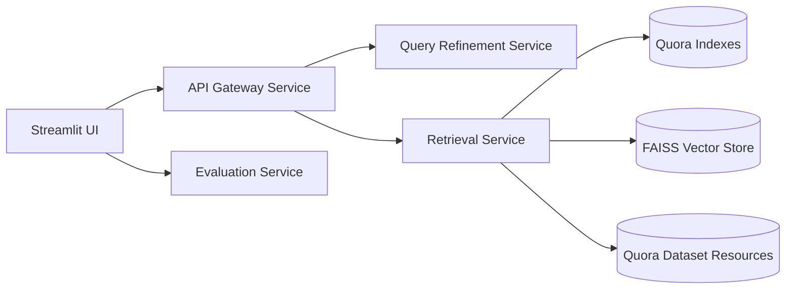

# توثيق SOA و Design Patterns

## الهدف المعماري

تم بناء المشروع بأسلوب Service Oriented Architecture بحيث تكون كل مسؤولية ضمن خدمة مستقلة. هذا يحقق فصل المسؤوليات، سهولة الصيانة، وإمكانية تطوير أو اختبار كل خدمة بدون التأثير المباشر على باقي النظام.

## الخدمات

| Service | المسؤولية |
| --- | --- |
| Preprocessing Service | تنظيف النصوص، حذف stopwords، stemming |
| Indexing Service | بناء inverted index وإرجاع إحصائيات الفهرسة |
| Retrieval Service | تنفيذ TF-IDF و BM25 و Semantic FAISS و Hybrid Retrieval |
| Query Refinement Service | تحسين الاستعلام، expansion، stemming اختياري |
| Evaluation Service | حساب Precision, Recall, MRR, MAP, nDCG |
| Gateway Service | نقطة دخول موحدة تنسق بين refinement و retrieval |
| Streamlit UI | واجهة تفاعل المستخدم وعرض النتائج والتقييم |

## مخطط معماري

## Design Patterns المستخدمة

| Pattern | مكان الاستخدام | الفائدة |
| --- | --- | --- |
| API Gateway | `services/gateway_service/main.py` | توحيد نقطة الدخول وإخفاء تفاصيل الخدمات الداخلية عن الواجهة |
| Strategy Pattern | `RETRIEVAL_STRATEGIES` في Gateway | اختيار طريقة البحث المناسبة حسب `retrieval_mode` بدون if/elif طويلة |
| Factory Method | دوال `build_*_payload` في Gateway | بناء payload مناسب لكل نموذج استرجاع بشكل مستقل وقابل للتوسعة |
| Repository / Resource Manager | `services/retrieval_service/dataset_manager.py` | عزل تحميل موارد الداتا والفهارس عن منطق البحث |
| Singleton Cache | `_resource_cache` و `lru_cache` | تحميل موارد Quora ونموذج SentenceTransformer مرة واحدة لتقليل استهلاك الذاكرة |
| Pipeline Pattern | Gateway pipeline | تمرير الاستعلام عبر refinement ثم retrieval ثم ranking |

## Clean Architecture

تقسيم المشروع يدعم Clean Architecture بشكل عملي:

- واجهة المستخدم لا تصل مباشرة إلى الفهارس، بل تستخدم Gateway.
- Gateway لا ينفذ نماذج البحث بنفسه، بل ينسق بين الخدمات.
- Retrieval Service مسؤول فقط عن البحث والترتيب.
- Evaluation Service مسؤول فقط عن المقاييس.
- Dataset Manager يعزل تفاصيل الملفات والفهارس عن منطق النماذج.

## قابلية التوسع والصيانة

لإضافة نموذج استرجاع جديد، نضيف endpoint داخل Retrieval Service ثم نضيف strategy جديدة داخل `RETRIEVAL_STRATEGIES` في Gateway. لا نحتاج لتغيير الواجهة أو إعادة كتابة pipeline كامل.

لإضافة Dataset جديدة مستقبلاً، يتم توسيع `SUPPORTED_DATASETS` داخل `dataset_manager.py` وبناء مواردها، مع إبقاء واجهات البحث نفسها.

## Loose Coupling

التواصل بين الخدمات يتم عبر REST API. كل خدمة يمكن تشغيلها أو اختبارها بشكل مستقل، وهذا يقلل الاعتماد المباشر بين الملفات ويجعل النظام أوضح للتطوير الجماعي.
